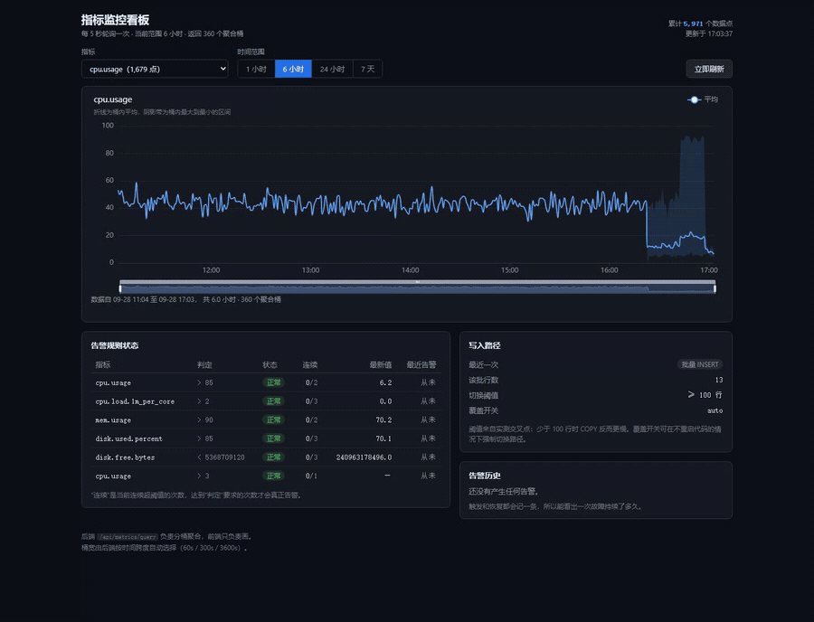

# metric-platform

Self-hosted metric collection with anomaly alerts, built as a single Spring Boot
service on PostgreSQL.

The point of the project is the alert pipeline, not the chart. Most small
monitoring setups either page on every threshold crossing or never page at all;
this one keeps a state machine per rule so a spike stays quiet, a sustained
excursion notifies once, and a recovery notifies again.



*Dashboard recorded against this repository's running stack. Playback is 2x;
the raw recording is kept out of the repository. The chart shows a full day of
one-minute samples; the alert transition at the end is the host's own measured
CPU value breaching a rule created for the demonstration, evaluated by the
shipped state machine.*

## What it does

- **Ingestion**: `POST /api/metrics/batch` stores up to 1000 points per request,
  routed by batch size between a JDBC batch of `INSERT` statements and a single
  `COPY FROM STDIN` stream. The response names the route that served it.
- **Query**: `GET /api/metrics/query` aggregates into fixed-width buckets. The
  bucket width is chosen from the requested span (60s / 300s / 3600s) so a
  seven-day view returns a comparable number of points to a one-hour view.
- **Detection**: alert rules compare either against an absolute threshold or
  against `mean + k * stddev` computed over a configurable lookback window. The
  statistics are computed in PostgreSQL, not in the application.
- **Alert state machine**: every rule carries `ok → pending → firing → ok`
  state with a consecutive-breach counter and a cooldown window.
- **History**: both firing and recovery are written to `alert_event`, so the
  duration of an incident is queryable.
- **Delivery**: notifications leave the evaluation path on a dedicated thread,
  with SMTP timeouts set so a hung mail server cannot stall anything.
- **Retention**: points older than the configured window are deleted in bounded
  batches.

## Architecture

```
  agent / seed script
          │  POST /api/metrics/batch
          ▼
  ┌───────────────────────┐        ┌──────────────────────────┐
  │  MetricController     │───────▶│  metric_point (Postgres) │
  └───────────────────────┘        └────────────┬─────────────┘
                                                │ latest / baseline
  ┌───────────────────────┐   every 30s         ▼
  │  AlertEvaluator       │◀───────  ┌────────────────────┐
  │  (scheduled)          │          │  AlertStateMachine │  pure decision logic
  └───────┬───────────────┘          └────────────────────┘
          │ state + event
          ▼
  ┌───────────────────────┐        ┌──────────────────────────┐
  │  AlertStore           │───────▶│ alert_state, alert_event │
  └───────────────────────┘        └──────────────────────────┘
          │ on firing / resolved
          ▼
  ┌───────────────────────┐
  │  AlertNotifier        │  single background thread, SMTP timeouts
  └───────────────────────┘
```

## Dashboard

A Vue 3 + ECharts single-page dashboard lives in `frontend/`. It polls the API;
there is no push channel, because the backend's own refresh cadence is measured
in seconds and a socket would add lifecycle handling for no visible benefit.

```bash
cd frontend
npm install
npm run dev          # http://localhost:5173, proxies /api to 127.0.0.1:8080
```

Start the backend first. What the page shows:

| Region | Source | Notes |
| --- | --- | --- |
| Line chart | `GET /api/metrics/query` | average plus the bucket's max/min envelope |
| Time range | local | 1h / 6h / 24h / 7d; the bucket width comes from the backend, chosen from the span |
| Alert rules | `GET /api/alerts/status` | `ok` / `pending` / `firing`, consecutive count, last value |
| Alert history | `GET /api/alerts/events` | firing and resolution, so an incident's duration is visible |
| Write path | `GET /api/metrics/ingestion` | which route served the last batch, plus the threshold in force |

The write-path card is what makes the ingestion work visible instead of buried in
configuration: send a 3-point batch and it reads "批量 INSERT", send 1,000 points
and it reads "COPY FROM STDIN".

Production build:

```bash
npm run build        # emits frontend/dist
```

ECharts is imported per component (`echarts/core` plus only the chart, axis, and
renderer modules this page uses) rather than from the package index. The full
import cost 1,113 kB against 595 kB tree-shaken, 374 kB gzipped against 204 kB.

## Host agent

`agent/agent.py` samples this machine with psutil and pushes the readings to the
platform, which is what makes the dashboard a view of a real host rather than a
replay of generated data.

```bash
pip install psutil
python agent/agent.py --once          # collect two readings and print them
python agent/agent.py                 # collect every 10s against localhost:8080
python agent/agent.py --url http://host:8080 --interval 5 --host web-01
```

Apply the rules that match what it emits:

```bash
psql -U metrics -h 127.0.0.1 -d metrics -f agent/rules.sql
```

Metrics reported: `cpu.usage`, `cpu.load.1m_per_core`, `mem.usage`,
`mem.available.bytes`, `disk.used.percent`, `disk.free.bytes`,
`disk.read.bytes_per_sec`, `disk.write.bytes_per_sec`, `disk.busy.percent`,
`net.sent.bytes_per_sec`, `net.recv.bytes_per_sec`. Disk metrics carry a `mount`
label, so one rule covers every volume.

Sampling and reporting run on separate threads with a bounded queue between
them, so a slow platform cannot change the sampling cadence and an outage
degrades into dropped samples rather than unbounded memory. Every rate is
computed from `time.monotonic` deltas rather than the nominal interval. Details
and limitations: [agent/README.md](agent/README.md).

## Requirements

- JDK 21
- Node 20 or newer for the dashboard
- Python 3.10 or newer plus psutil for the host agent
- PostgreSQL 16 or newer, reachable as `metrics` / `metrics`
- Maven 3.9+ (or use the bundled wrapper once generated)

## Database setup

The schema is applied automatically on startup from
`src/main/resources/schema.sql`. To create the role and database first:

```sql
CREATE USER metrics WITH PASSWORD 'metrics';
CREATE DATABASE metrics OWNER metrics;
```

## Run

```bash
export ALERT_MAIL_TO=you@example.com   # optional; empty disables mail delivery
mvn spring-boot:run
```

Override the datasource with `DB_URL`, `DB_USER`, and `DB_PASSWORD`.

## Verify

```bash
# store one point
curl -s -X POST localhost:8080/api/metrics/batch \
  -H 'Content-Type: application/json' \
  -d '{"points":[{"name":"cpu.usage","ts":"2026-09-23T10:00:00Z","value":42.5,"tags":{"host":"h1"}}]}'
# -> {"accepted":1}

# generate a day of data with two scripted anomalies
python scripts/seed.py --minutes 120

# aggregate (bucket width chosen automatically)
curl -s "localhost:8080/api/metrics/query?name=http.latency.p95\
&from=2026-09-23T00:00:00Z&to=2026-09-23T23:59:59Z" | head -c 400

# alert state and history
curl -s localhost:8080/api/alerts/status
curl -s localhost:8080/api/alerts/events
```

## API

| Method | Path | Purpose |
| --- | --- | --- |
| POST | `/api/metrics/batch` | store up to 1000 points |
| GET | `/api/metrics/query` | aggregate one metric over a range |
| GET | `/api/metrics/names` | list metrics with point counts |
| GET | `/api/metrics/count` | total stored points |
| GET | `/api/metrics/ingestion` | last write path taken, threshold, and override |
| GET | `/api/alerts/status` | current state of every rule |
| GET | `/api/alerts/events` | alert history, newest first |
| POST | `/api/alerts/rules` | create a rule |
| POST | `/api/alerts/rules/{id}/enabled` | enable or disable a rule |
| POST | `/api/alerts/rules/{id}/evaluate` | evaluate one rule now |
| DELETE | `/api/alerts/rules/{id}` | delete a rule |

## Design decisions

**Why `JdbcTemplate` instead of JPA.** Every read is an aggregate over a time
bucket. An ORM would map entities the queries never materialise, and the
bucketing expression (`floor(epoch / width) * width`) has no ORM equivalent.

**Why the bucket width comes from the span.** A fixed width serves one zoom
level only. Choosing from the span keeps the response bounded at roughly the
same number of buckets regardless of the range, which is what makes the wide
queries fast.

**Why the alert state machine lives in the application, not in SQL.** The
transitions depend on the previous state, the elapsed cooldown, and the
consecutive count. Expressing that in a single SQL statement is possible but
unreadable, and the decision logic is the part worth testing directly. It is a
pure function over records, so `AlertStateMachineTest` covers the whole table
without a database.

**Why consecutive breaches and cooldown are separate knobs.**
`minConsecutive` filters transient spikes before anything is sent. `cooldown`
suppresses repeats while the metric keeps breaching. A metric that stays
breaching remains in `firing`; the cooldown only controls notification, which is
why an ongoing incident's duration stays visible in the stored state.

**Why notifications are not retried.** A retry queue needs durability, ordering,
and a dead-letter story. At this alert volume the failure mode of a dropped
notification is acceptable and the failure is logged. Adding the queue is the
first item under deferred work.

**Why ingestion routes by batch size instead of always using COPY.** The
benchmark shows COPY is slower below roughly a hundred rows per call, because
its fixed per-call protocol setup outweighs the per-row parser and planner work
it avoids. A single deployment-wide choice would therefore be wrong for one of
the two regimes; the selection is per request and the threshold comes from the
measurement.

**Why `CopyMetricStore` is not `@Transactional`.** It borrows its own connection,
so an outer transaction would not cover the COPY stream and the annotation would
only mislead a reader. One `COPY` is atomic by itself; there is no partial-batch
rollback and no `ON CONFLICT` or `RETURNING` on this path.

**Why statistics run in PostgreSQL.** The baseline needs an aggregate over a
window. Pulling raw points into the JVM to average them would move the entire
window over the wire on every evaluation.

## Measured behaviour

Numbers below were produced on this machine (PostgreSQL 17.11, Windows) and are
re-measurable from the scripts in `scripts/` and the benchmark in
`src/main/java/com/example/metrics/bench/`. They describe this host, not the
design; re-measure before quoting them.

**Ingestion — write path comparison.** Same table, same 100,000 points, same
machine and driver; only the write path changes. 1 warm-up run, median of 7.

| rows per call | `batchUpdate` (rows/s) | `COPY FROM STDIN` (rows/s) | ratio |
| ---: | ---: | ---: | ---: |
| 1 | 7,605 | 5,102 | **0.67x** |
| 100 | 63,246 | 92,199 | 1.46x |
| 1,000 | 72,371 | 106,700 | 1.47x |
| 10,000 | 71,481 | **126,392** | **1.77x** |

Three things the table says that a single headline number would hide:

- **COPY loses below roughly 100 rows per call.** Each `copyIn` pays a fixed
  protocol setup cost, so at one row per call that cost is paid per row.
- **`batchUpdate` plateaus after 1,000 rows** (72,371 → 71,481). Past that point
  the bottleneck is server-side heap insert and WAL, which both paths pay, which
  is why the ceiling here is 1.7x rather than an order of magnitude.
- **1.77x is a localhost floor, not a general figure.** The machine is the same
  host, so round-trip latency is ~0. A remote database would widen the gap,
  since `batchUpdate` needs a round trip per batch and COPY needs one per stream.

A control run with `reWriteBatchedInserts=false` produced the same magnitude
(~75k vs ~121k best-case), confirming the driver's INSERT rewriting is not what
the comparison is measuring.

**Ingestion — the selection is live, not just measured.** `MetricController`
posts through `MetricIngestionService`, which routes each request by batch size
using the measured crossover:

| request rows | route | response |
| ---: | --- | --- |
| 1 / 50 / 99 | `batchUpdate` | `{"accepted":99,"route":"batch"}` |
| 100 / 1,000 | `COPY FROM STDIN` | `{"accepted":1000,"route":"copy"}` |

The route is reported in the response body so the choice is observable in
production rather than inferred from configuration. `metric-platform.ingestion
.force-path` pins one path (`batch` or `copy`) for benchmarking and for rolling
back a bad ingestion change without a code revert; verified by starting with
`--metric-platform.ingestion.force-path=batch` and observing `route":"batch"`
at 1,000 rows.

**Ingestion — end-to-end over HTTP.** 100 requests of 1,000 points (100,000
points, 80 KB payloads) through the API: **3.41 s, ~29,400 points/s**. This is
3-4x below the direct JDBC figure above because the timed path adds JSON
deserialization, bean validation, a synchronous HTTP client, and controller
dispatch. It is the number that describes what a real agent gets; the JDBC table
describes the write path in isolation.

Reproduce with:

```bash
mvn -q compile
mvn -q exec:java -Dexec.mainClass=com.example.metrics.bench.WritePathBenchmark \
    -Dexec.args="100000 7"
```

Full methodology and the interview-relevant trade-offs:
[docs/write-path-experiment.md](docs/write-path-experiment.md).

**Ingestion — server-side bulk upper bound.** 100,000 points loaded by one
`INSERT ... SELECT generate_series` in **848 ms** (~118k rows/s). This is the
server's own bulk path with no client involved, so it bounds what any client-side
path can reach on this hardware.

**Read amplification** — the same seven-day window:

| query shape | rows returned | time |
| --- | --- | --- |
| raw scan, no bucketing | 60,479 rows | 13.9 ms |
| bucketed at 300 s | 289 rows | 4.4 ms |

The win is the row count, not the milliseconds: 60,479 points become 289 points,
which is what keeps the browser fast.

**Index usage** — `EXPLAIN (ANALYZE)` on the bucketed range scan shows
`Bitmap Index Scan on idx_metric_point_name_ts`, so the composite index is
actually used rather than merely present.

**Statistical baseline** — mean and population standard deviation over a ten
minute window (59 samples) computed in **0.27 ms**: mean 136.015, stddev 10.837,
three-sigma bound 168.527. At that cost the baseline can be recomputed on every
evaluation pass.

**Alert state machine** — the full lifecycle, observed through the HTTP API:

| step | input | resulting state | event |
| --- | --- | --- | --- |
| 1 | 95.0, first breach | `pending`, consecutive 1 | none |
| 2 | 96.0, second breach | `firing`, consecutive 2 | `FIRING` |
| 3 | 97.0, inside cooldown | `firing`, consecutive 3 | none |
| 4 | 30.0, recovered | `ok`, consecutive 0 | `RESOLVED` |
| 5 | 25.0, still normal | `ok`, consecutive 0 | none |

History after the run held exactly two rows, one `FIRING` and one `RESOLVED`.

## Known limitations and deferred work

- **Single-writer ingestion.** No write batching daemon, no queue. Sustained
  ingestion above what one JDBC connection achieves would need an external
  buffer; the COPY path raises the ceiling but does not remove it.
- **The COPY payload is built fully in memory before it is sent.** A request of
  1,000 points is small enough that this is invisible, but the streaming API
  (`copyIn` with a `Reader` fed incrementally) is what would make a much larger
  batch safe, and the benchmark's COPY figure is conservative because of it.
- **Notification delivery is best-effort.** No retry, no dead-letter, no
  per-channel fan-out. Only mail plus the logged transition.
- **The mail health indicator reports `DOWN` when no SMTP server is reachable,**
  which makes `/actuator/health` return 503 even though the API is healthy. Run
  with `management.health.mail.enabled=false` when mail is not configured.
- **The staleness guard is global, not per rule.** `max-point-age-seconds`
  applies to every metric, so a metric that is legitimately slow-moving (a daily
  counter) needs a larger value or it is skipped.
- **The query response does not report the bucket width it chose.** A client
  cannot label the axis without re-deriving the tier from the span.
- **Sigma bound assumes a roughly stationary metric.** A metric with a daily
  cycle will produce false positives because the baseline window is a plain
  mean, not a seasonal decomposition.
- **No tag-based rule scoping.** Rules match a metric name only, so a rule
  cannot target `host=host-3` alone.
- **No downsampling at rest.** Old points stay at full resolution until they
  are deleted; a tiered table would be the next step.
- **No authentication.** The API assumes a trusted network. Credentials and
  authorization are not implemented.

## Layout

```
src/main/java/com/example/metrics/
├── config/        deployment settings, web configuration
├── domain/        records and enums: rule, state, event, evaluation
├── service/       state machine, evaluator, notifier, retention job
├── store/         JdbcTemplate repositories
└── web/           controllers and request/response records
scripts/seed.py    simulated data with scripted anomalies
```
