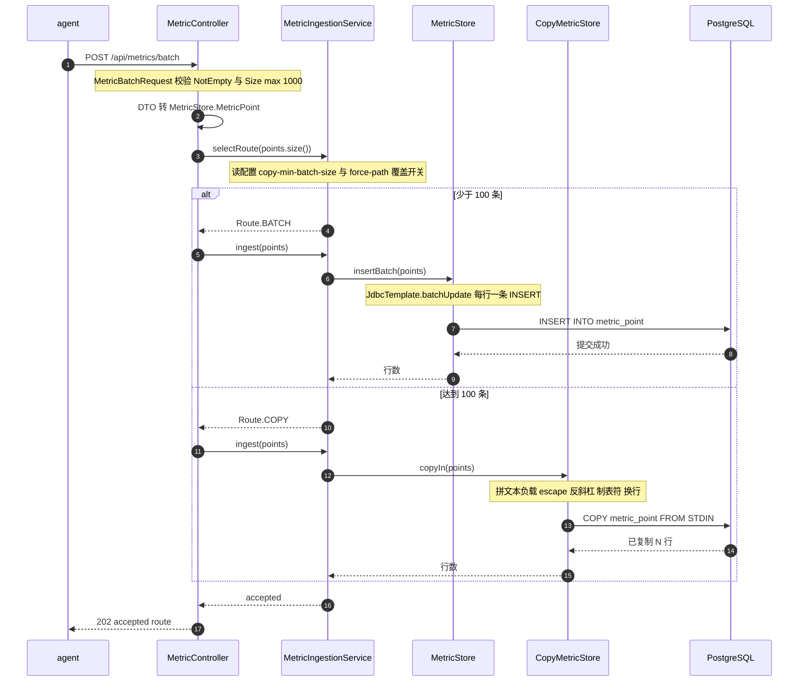
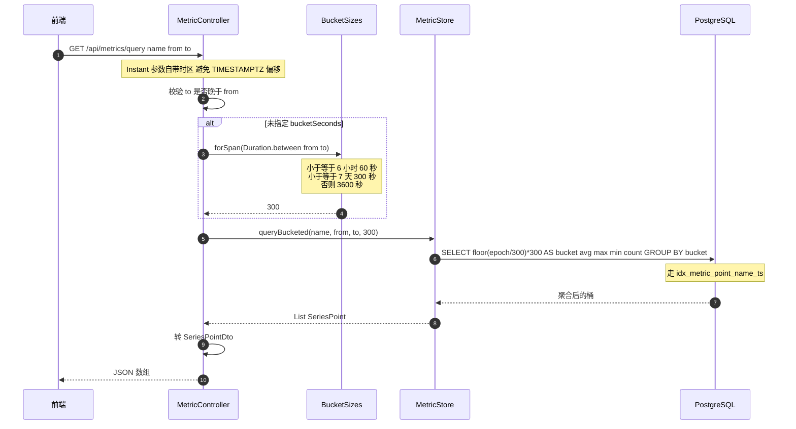
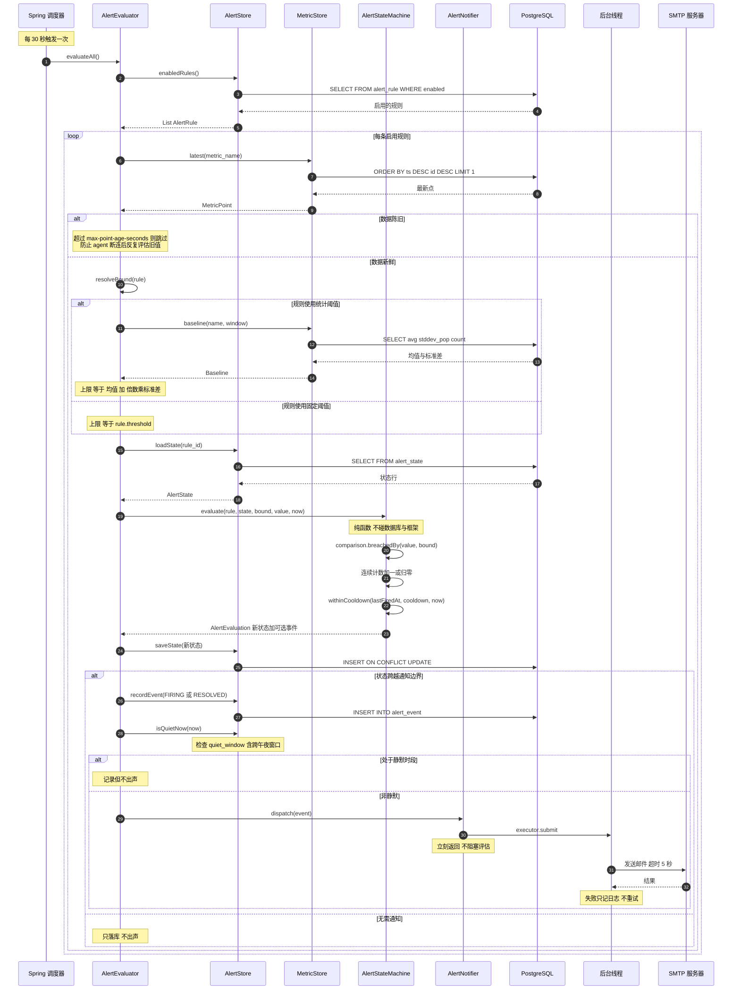

# 时序图：一次上报到一封告警邮件

以下三张图对应仓库中的真实类与方法，方法名可直接在源码中检索。

## 图 1：数据摄取，含双写入路径分岔



`selectRoute` 与 `ingest` 是两次独立调用：先问走哪条，再执行。响应里的 `route`
是决策结果，不是事后推断。

## 图 2：查询与自动降采样



分桶用 `floor(epoch / 桶宽) * 桶宽` 而不是 `date_trunc`，因为后者只接受分钟、小时
这类固定单位，而前者支持任意桶宽。

## 图 3：定时巡检到邮件送达



## 时间轴

```
t=0s        agent 上报，图 1 完成，数据落库
t=0-30s     无事发生，数据静置在 metric_point
t=30s       调度器唤醒，图 3 开始
t=30s       取最新值、算基准、状态机判定
t=30s       若跨越边界：写 alert_event 并投递到后台线程
t=30s       evaluateAll 返回，主流程结束，不等邮件
t=31s       后台线程发完邮件
```

`dispatch` 只把任务投入队列便返回，所以评估总耗时不受 SMTP 影响。这是图中
`N->>MB` 与 `MB->>MAIL` 分属两条生命线的原因。

## 抖动与真故障的分道扬镳

同样从 `AlertStateMachine.evaluate` 开始，取值序列不同则结果完全不同：

| 步骤 | 抖动场景 | 真故障场景 |
| --- | --- | --- |
| 第 1 次评估 | 95 大于 85，连续计数 0 变 1 | 同左 |
| 判定 | 1 小于 minConsecutive 2，进入 pending | 同左 |
| 落库 | 写 alert_state，不写 event | 同左 |
| 第 2 次评估 | 40 小于 85，回到 ok | 96 大于 85，连续计数 1 变 2 |
| 判定 | 状态非 firing，静默归零 | 达到阈值且状态非 firing，进入 firing |
| 通知 | 无 | 发出 FIRING 邮件 |
| 第 3 次评估 | 无 | 97，仍在冷却窗口内，只更新计数不发送 |

左列全程没有发出任何通知，这就是 `min_consecutive` 的全部意义。

## 调用链速查

| 层 | 类 | 关键方法 | 职责 |
| --- | --- | --- | --- |
| 入口 | `MetricController` | `ingest` `query` | 收请求、校验、转换表示 |
| 调度 | `MetricIngestionService` | `selectRoute` `ingest` | 选择写入路径 |
| 业务 | `AlertEvaluator` | `evaluateAll` `evaluateOnce` | 定时巡检与编排 |
| 核心 | `AlertStateMachine` | `evaluate` `withinCooldown` | 纯决策：状态与数值进，新状态出 |
| 业务 | `AlertNotifier` | `dispatch` | 通知离开请求路径 |
| 业务 | `RetentionJob` | `purgeExpired` | 分批删除过期数据 |
| 存储 | `MetricStore` | `insertBatch` `queryBucketed` `latest` `baseline` | 指标读写 |
| 存储 | `CopyMetricStore` | `copyIn` | COPY 流式写入 |
| 存储 | `AlertStore` | `loadState` `saveState` `recordEvent` `isQuietNow` | 规则与状态读写 |
| 工具 | `BucketSizes` | `forSpan` | 按跨度选择桶宽 |
